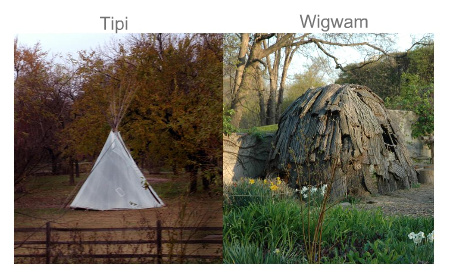
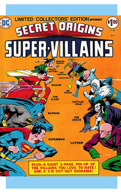

- title : Metaprogramming Madness
- description : Metaprogramming crazy land
- author : Ross McKinlay
- theme : night
- transition : zoom

***

## METAPROGRAMMING MADNESS

## THE MIXIN TIPI/WIGWAM

<small>Ross McKinlay 2015</small>

***
## ! WARNING !

***            
### ME
 
 
###@pezi_pink
 
 
###www.pinksquirrellabs.com

***
# WHAT IS A TYPE PROVIDER, REALLY?
 

###A compiler extension / plugin

###Lets you do compile time things ...

###Optionally, you might return some types!

***

## WHAT IS THE MIXIN PROVIDER 

DOES *MORE* THAN THIS!

***

###A TIPI!

###A Meta-Programming Infrastructure

###Intelligent Code Generation, Injection and Compilation

###A programming assistant!

###A WIGWAM!

     
***

##NORMAL TYPE PROVIDERS

***

##MIXIN WIGWAM-BAM!

***
                 

## CTFE 
### *Compile-Tme Function Execution*

***
     
## SQUIRRELMIX

###COMPOSITIONAL DOMAIN SPECIFIC LANGUAGE
***

## THE BRIDGE OF DEATH!

***

## FULL

***

## INJECTION

***

## GOOD VS EVIL  

***

## PROJECTS AND IDEAS

###Tickspec 2 - The Revenge

###camlp4 - all your metas...

###ERASING-MIXIN TYPE PROVIDERS!

      
***

## THIS WOULD NOT BE COMPLETE...

## WITHOUT A TYPE PROVIDER TYPE PROVIDER!

***
#QUESTIONS
 
 
##¿

