- title : Where No Type Has Gone Before
- description : Pushing F# types into new places
- author : Ross McKinlay
- theme : night
- transition : zoom

***

## TO BOLDLY GO

## WHERE NO TYPE
## HAS GONE BEFORE

<small>Ross McKinlay 2015</small>

***
### TB-303, 1982
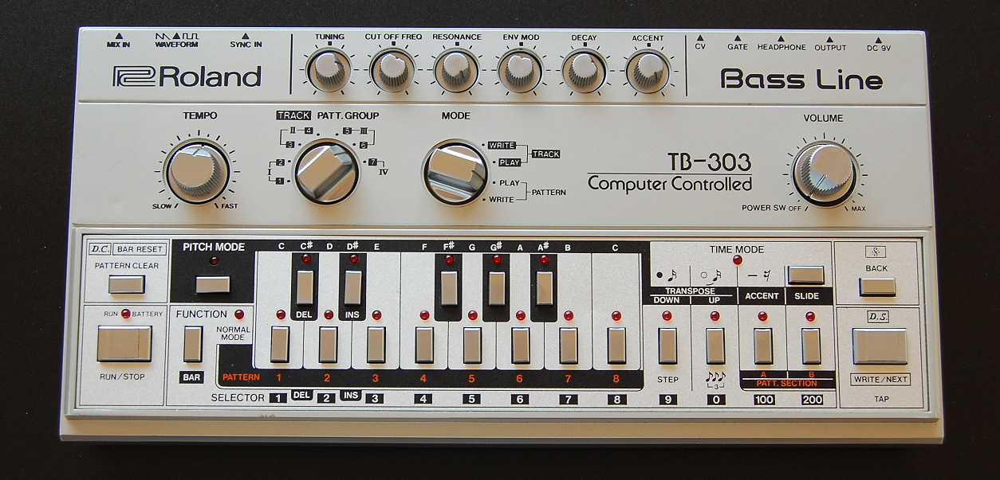
###Produced for just 2 years.
###A sad failure :(

###Perhaps the world just wasn't ready...

---

###1984
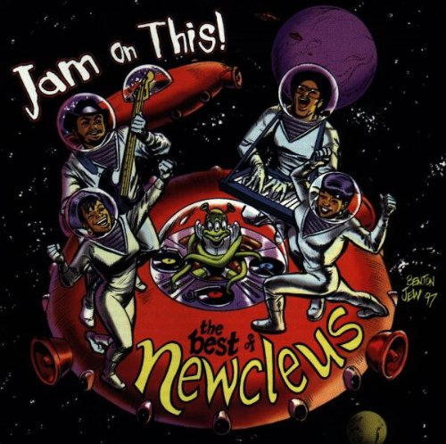
###What happens if we press..
## THESE buttons?

---

###1987

###What happens if we fiddle with ...
##ALL THE CONTROLS AT THE SAME TIME !?!

---

###1998

##Want a 303? Prepare to pay £2000, if you can find one!

***

### ME
 
 
###@pezi_pink
 
 
###www.pinksquirrellabs.com

---

####TYPE PROVIDERS: PROVIDING YER TYPES SINCE F# 3.0
 

<small>Do you have a schema for your information source? If so, what’s the mapping into the F# and .NET type system?</small>

<small>Can you use an existing (dynamically typed) API as a starting point for your implementation?</small>

<small>Will you and your organization have enough uses of the type provider to make writing it worthwhile? Would a normal .NET library meet your needs?</small>

<small>How much will your schema change?</small>

<small>Will it change during coding?</small>

<small>Will it change between coding sessions?</small>

<small>Will it change during program execution?</small>

<small>Type providers are best suited to situations where the schema is stable at runtime and during the lifetime of compiled code.</small>

   
 

####You should use this mechanism only where necessary and where the development of a type provider yields very high value.

---

##dun.Dun.DUUUN!

##FORGET THE GUIDELINES ..

---

###But first, a little terminology.

#### Erased Types
 

- Consist of two parts
- A compile-time type
- A runtime type

 
 
The compile-time type is said to </i>"erase down"</i> to the runtime type.
The compile-time types <i>disappear</i> at runtime.

***

##PART 1
#### CHOOSE YOUR OWN ADVENTURE

---

###STUFF LEARNT
 
 

####YOU CAN MAKE SILLY TYPE PROVIDERS

***

##PART 2
#### SQUIRRELIFY

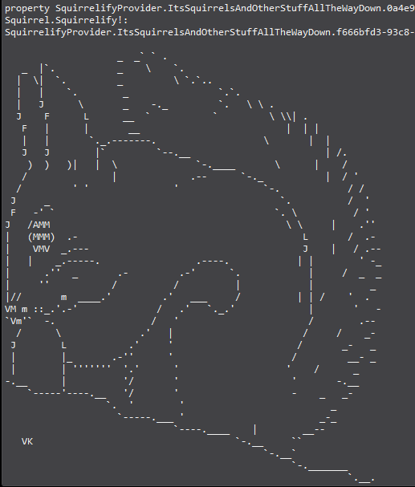

---

###STUFF LEARNT
 
 

####INFINITE (UNBOUNDED) TYPE SYSTEMS ARE POSSIBLE!

####INTELLISENSE WAS REALLY NOT DESIGNED FOR THIS..

####PARA AND ALT+255 ARE YOUR FRIENDS!

---

###POSSIBLE EXTENSIONS

####KEYWORD IMAGE SEARCH. ASCIIFIY. SHOW.

***

##PART 3
#### MINESWEEPER

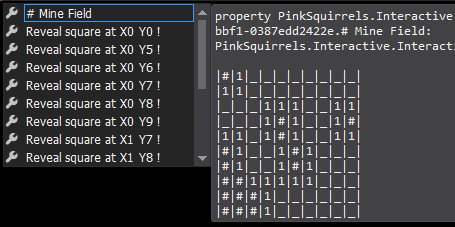

---

###STUFF LEARNT
 
 

####YOU CAN WRITE FULL ON PROPER GAMES!
<small>*with some limitations</small>

####INTELLISENSE IS STILL NOT DESIGNED FOR THIS..

####A FIXED-WIDTH FONT IN YOUR TOOLTIPS HELPS

####PROPERTIES ARE EVALUATED UP FRONT WHICH AN BE A MENACE!

***

---

##RDF TYPE PROVIDER

####ERASE TYPES TO <I>OTHER</I> ERASED TYPES ?

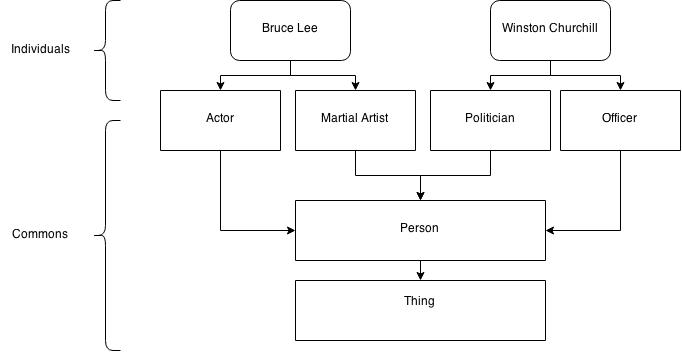

---

###STUFF LEARNT
 
 

####PSEUDO-INHERITANCE IS POSSIBLE WITH ERASED TYPES

####AN ODD KIND OF MULTIPLIE INHERITANCE IS POSSIBLE

####YOU CAN PROVIDE "LENSES" TO CONVERT BETWEEN COMPATIBLE ERASED TYPES

####YOU CAN CREATE MULTIPLE LAYERED COMPLEX TYPE SYSTEMS WITH NEGLIGIBLE RUNTIME COST

***

##PART 4
#### INTERACTIVE PROVIDER

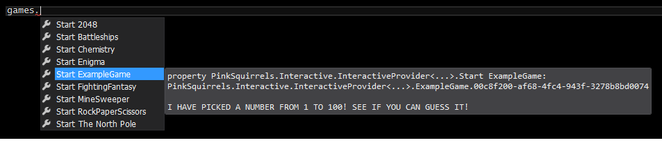

---

    type IInteractiveState=
        abstract member DisplayText : string
        abstract member DisplayOptions : (string * obj) list

    type IInteractiveServer = 
        abstract member NewState : IInteractiveState
        abstract member ProcessResponse : IInteractiveState * obj -> IInteractiveState

---

###STUFF LEARNT
 
 

####IT IS POSSIBLE AND USEFUL TO CREATE TYPE PROVIDER ABSTRACTION LAYERS

####THE PROCESS OF CREATING COMPLEX TYPE SYSTEMS IS VASTLY SIMPLIFIED

***

##PART 5
#### 2048

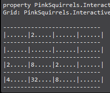

---

###STUFF LEARNT
 
 

####USING ABSTRACTIONS ALLOWS YOU TO FOCUS READILY ON THE PROBLEM RATHER THAN THE TYPE SYSTEM

####INTELLISENSE IS STILL NOT DESIGNED FOR THIS

***

##PART 6
#### FIGHTING FANTASY

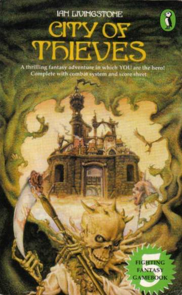

---

###STUFF LEARNT
 
 

####USING TYPE PROVIDERS INSIDE OTHER TYPE PROVIDERS IS POWERFUL AND EFFECTIVE

####INTELLISENSE IS REALLY, REALLY NOT DESIGNED FOR THIS

***

---

###STUFF LEARNT
 
 

####CRAZY STUFF HAPPENS IN TYPE PROVIDERS

***

##PART 7
#### MULTIPLAYER BATTLESHIPS

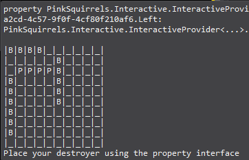

---

##COMMUNICATIONS
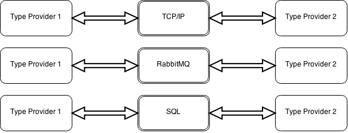

---

##THREADS

---

##AGENTS

---

###STUFF LEARNT
 
 

####TYPE SYSTEMS CAN BE MADE TO COMMUNICATE WITH EACH OTHER!

####YOU CAN PLAY MULTIPLAYER GAMES IN YOUR IDE INSTEAD OF WORKING!

####THREADS ARE A MENACE BUT CAN BE DEALT WITH!

####AGENTS WORK JUST FINE IN TYPE PROVIDERS..

####INTELLISENSE IS* SO* NOT DESIGNED FOR THIS

***

##PART 8
#### SANTA'S GROTTO

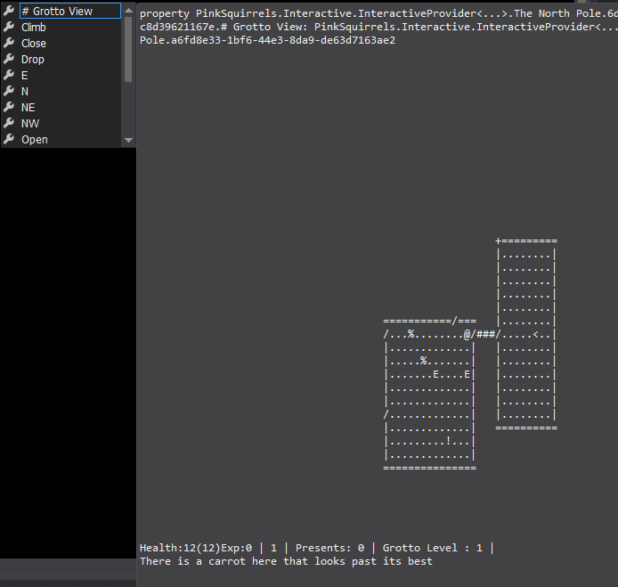

---

###STUFF LEARNT
 
 

####YOU CAN WRITE *REALLY* COMPLEX TYPE PROVIDER GAMES

####EVEN WITH THE ABSTRACTION, THE IP GETS UNWIELDY WITH LARGE SYSTEMS

***

##PART 9
#### ENIGMA 

---

    type IInteractiveServer = 
        abstract member NewState : IInteractiveState
        abstract member ProcessResponse : IInteractiveState * obj -> IInteractiveState

    type InteractiveState<'a> =
        { displayOptions : 'a -> (string * obj) list 
          displayText : 'a -> string 
          processResponse : 'a * obj -> IInteractiveState
          state : 'a }
        member x.ProcessResponse o = x.processResponse (x.state, o)
        interface IInteractiveState with
            member x.DisplayOptions =  x.displayOptions x.state
            member x.DisplayText = x.displayText x.state

    type Enigma() =
        interface IInteractiveServer with
            member x.NewState: IInteractiveState = start() :> IInteractiveState        
            member x.ProcessResponse(state: IInteractiveState, response: obj): IInteractiveState =      
                let state = (state:?>InteractiveState<EnigmaTypes>)
                state.ProcessResponse(response) 
                                        

---        

###STUFF LEARNT
 
 

####ABSTRACTION LAYERS ARE COOLER WHEN ABSTRACTED MORE!

***

##PART 10
#### INCEPTION PROVIDER

---
###THINGS I HAVE TRIED

 
 

####ALL THE 'OBVIOUS' THINGS

####HOSTING AN FSI SESSION IN A TP

####ERASING TO EXISING TYPE PROVIDERS

####EMITTING IL IN TP QUOTATIONS

####HOSTING THE F# COMPILER, BUILDING AN ASSEMBLY AND LOADING IT

---

###STUFF LEARNT
 
 

####INHERITANCE WITH TYPE PROVIDERS WORKS JUST FINE

####THE PROVIDED TYPES API DOESN'T LET YOU DO A WHOLE BUNCH OF STUFF

####ALL KINDS OF THINGS!  EXCEPT HOW TO GET THIS TO WORK...

---

###THINK OF THE POSSIBILTIES...
 
 

####A 'PACKAGE' TYPE PROVIDER. ONE TYPE PROVIDER THAT GETS OTHER TYPE PROVIDERS

####TYPE PROVIDERS THAT SEND SERIALIZED QUOTATIONS TO OTHER TYPE PROVIDERS

####TYPE PROVIDERS THAT SEND / GET SERIALIZED .NET ASSEMBLIES

***

##IN CONCLUSION

 

####There is certainly big scope for creating type provider toolkits and abstraction layers

####I have tried many crazy things that may be genuinely useful!

####I have tried many crazy things are probably completely useless

####Maybe YOU can dream up some idea that will become the next big thing for type providers!

***

#QUESTIONS
 
 
##¿

